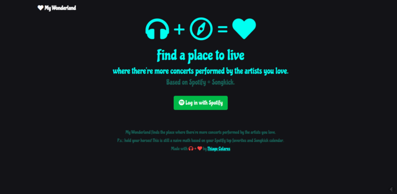
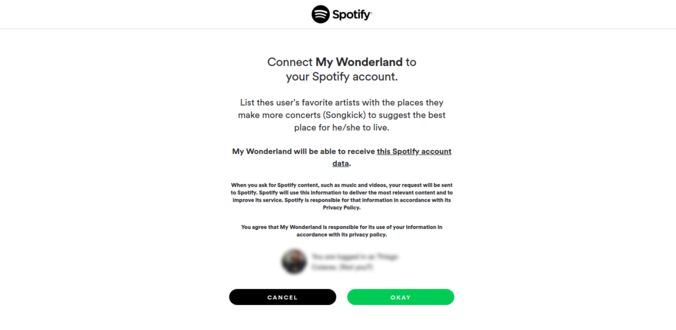
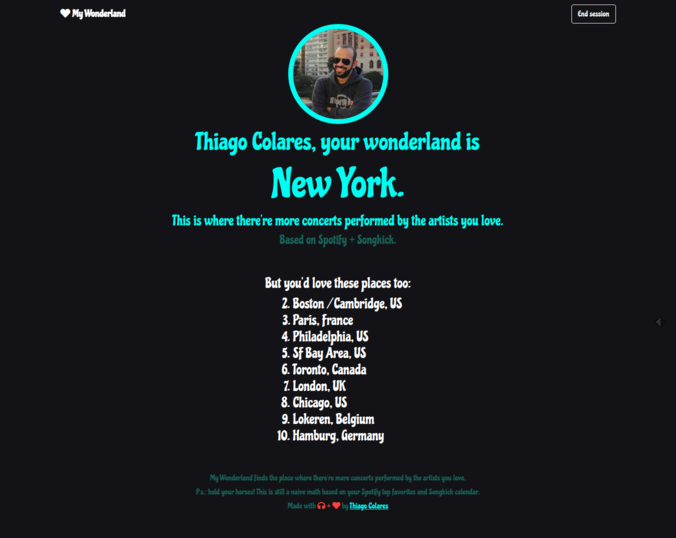

# My Wonderland
A simple tool that helps you to find the place where there're more concerts performed by the artists you love.

It matches your Spotify profile with Songkick calendar and venues in the near future.

# Installation

## System requirements
* &ge; PHP 7.1 
* [composer](https://getcomposer.org)

## Other requirements
### Spotify API Key
**I'm using the new Beta API (as on Apr 7th 2018).** Apply for Spotify API key. The request is processed immediately.
https://beta.developer.spotify.com/

From May 7th 2018 and on:
https://developer.spotify.com/

### Songkick API Key
Apply for Songkick API key. The request is analyzed by a human being and can take more than one day :\ 
https://www.songkick.com/api_key_requests/new

## Install 
#### 1. Run the commands below:
    $ git clone https://github.com/colares/my-wonderland.git
    $ cd my-wonderland
    $ composer install
    $ cp .env.example .env

#### 2. Use your favorite text editor / IDE to set <code>.env</code> variables.

#### 3. Setup your nginx / Apache 2 considering the root folder below and restart it.

    /host-path/my-wonderland/src 

#### 4. Config your <code>/etc/hosts</code>:

    127.0.1.1       your-fancy-local-url.localhost

#### 5. You're done. Visit:

    http://your-fancy-local-url.localhost

# Screenshots

## Welcome

## Connect My Wonderland to your Spotify account

## Find your wonderland
New York? Sweet!

